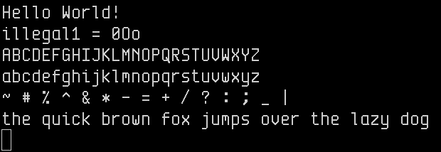
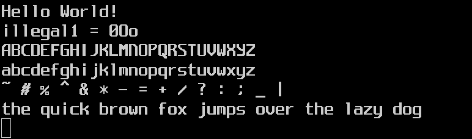
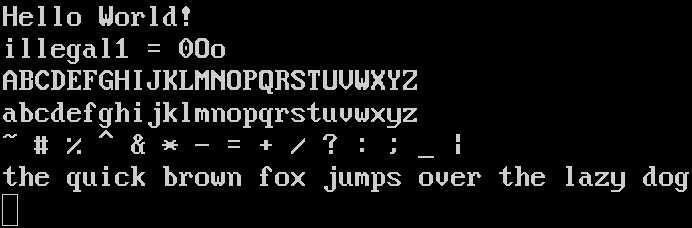

# Large crisp bitmap fonts for HDPI screens. Doubled from their original sizes, then manually depixelized.

The attempt when placing pixels was to generally guess the original creator's intention, but some minor artistic license was taken. Issues or pull requests welcome if you think a particular pixel should be flipped or moved.

Instructions:

```
xset fp+ $PWD
xset fp rehash
xterm -fn -ypn-envypn_b2hdpi-medium-r-normal--30-300-75-75-c-180-iso8859-1
xterm -fn -misc-lode_b2hdpi-medium-r-normal--30-300-75-75-c-160-iso10646-1
xterm -fn -ibm-vga_b2hdpi-normal-r-normal--32-240-96-96-c-160-iso10646-1
```

## -ypn-envypn_b2hdpi-medium-r-normal--30-300-75-75-c-180-iso8859-1



Source: https://github.com/hicolour/envypn-font


## -misc-lode_b2hdpi-medium-r-normal--30-300-75-75-c-160-iso10646-1



Source: https://github.com/hishamhm/lode-fonts


## -ibm-vga_b2hdpi-normal-r-normal--32-240-96-96-c-160-iso10646-1



Source: https://github.com/farsil/ibmfonts
